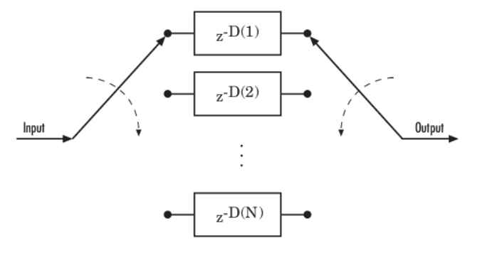
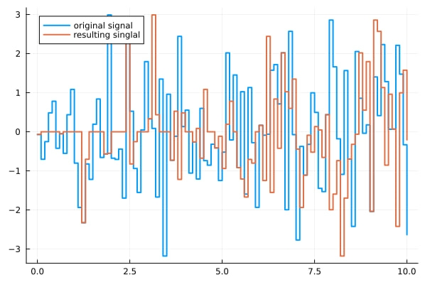
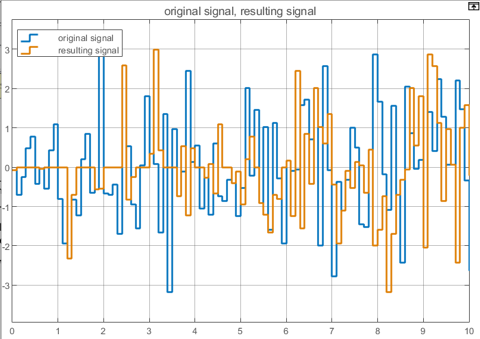
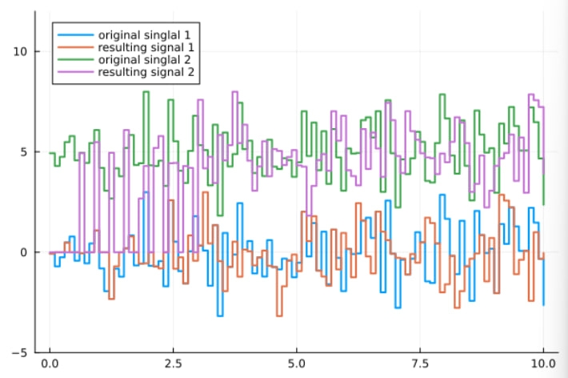
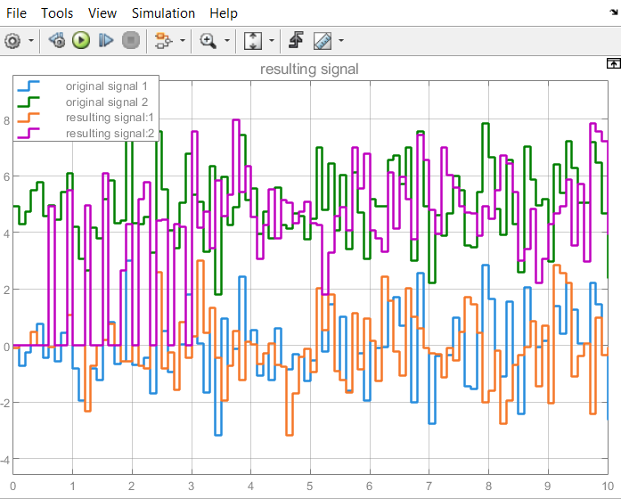

# Реализация блока сверточного перемежения Convolutional Interleav из Simulink

## Описание
Блок сверточного премежения переставляет символы во входноми сигнале. Внутри он использует набор сдвиговых регистров.

### Параметры:
- N - количество сдвиговых регистров, используемых блоком внутри системы.
- B - количество дополнительных символов, которые помещаются в каждый последующий сдвиговый регистр, если первый регистр содержит ноль символов.
- IC - значения, заполняющие каждый регистр сдвига, регистрируются в начале моделирования(за исключением первого регистра сдвига, у которого задержка равна нулю). 

Если IC - скалярное значение, то его значение заполняет все регистры сдвига, кроме первого;
Если IC - вектор-столбец, длина которого равна параметру N, то каждая запись заполняет сответствующий регистр сдвига. 
Значение первого элемента параметра IC не имеет значения, поскольку первый регистр имеет нулевую задержку.

Этот  блок принимает на вход скалярный или вектор-столбец сигнал, который может быть действительным(<:Real) или комплексным(<:Complex). Выходной сигнал имеет ту же частоту дискретизации, что и входной сигнал.

Блок может принимать данные следующих типов: Int8, UInt8, Int16, UInt16, Int32, UInt32, Int64, UInt64, Bool, Float32, Float64. Тип данных этого выхода будет совпадать с типом данных входного сигнала.

На этой диаграмме показана структура общего сверточного перемежителя, состоящего из набора сдвиговых регистров, каждый из которых имеет заданную задержку, обозначенную как D(1), D(2),...,D(N), где N - количество сдвиговых регистров, и коммутатора для переключения входных и выходных символов через регистры. k-ый сдвиговый регистр имеет значение задержки: (k-1)*B. С каждым новым входным символов коммутатор переключается на новый регистр и сдвигает новый символ, одновременно сдвигая самый старый символ в этом регистре. Когда коммутатор достигает N-ого регистра, при следующем новом входном сигнале коммутатор вовзращается к первому регистру.

## Проверка работы блока с работой блока в Simulink 
### Пример 1:
Блок работает со следующими параметрами:
- N = 6
- B = 2
- ic = 0

На вход подается скалярный сигнал, полученный из блока Random Number из Simulink. 

Результаты сигналов, полученные из моего блока и блока Simulink, описанные в виде графиков:
 

### Пример 2:
Блок работает со следующими параметрами:
- N = 6
- B = 2
- ic = 0

На вход подается векторный сигнал, первая компонента которого совпадает с входом из 1-ого примера, а вторая - с входом 1-ого примера + 5. 

Результаты сигналов, полученные из моего блока и блока Simulink, описанные в виде графиков:
 